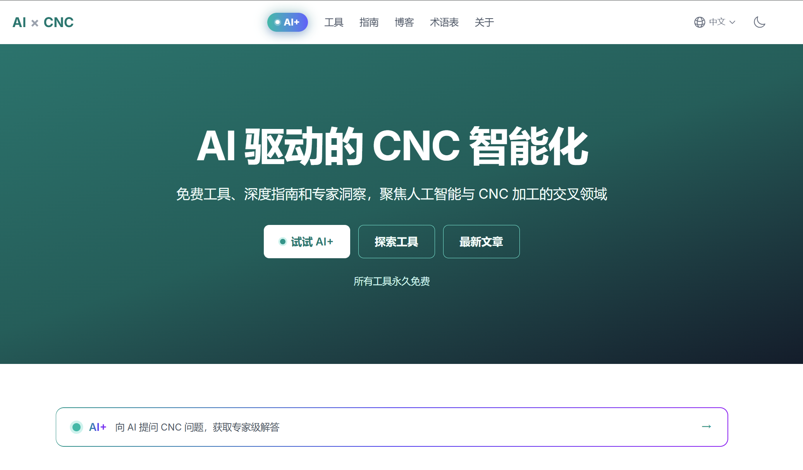

# 打算做一个 AI x CNC 的网站

从开始使用 AI 进行 Vibe Coding，感觉自己逐渐成了一个产品体验官，各家的 AI 模型、工具如数家珍，但是真正能拿出手的东西啥也没有，所以打算从自己熟悉的领域入手，做一些东西出来。

初步打算先做一个 AI x CNC 的网站，是一个永久免费的站点。

一方面，AI 技术已经足够成熟，可以显著提升 CNC 加工的效率和质量；另一方面，绝大多数 CNC 从业者对 AI 的了解仅停留在概念层面，缺乏实用的工具和深入浅出的指导。我想做一个提供真正有价值的免费工具和内容的站点，为我们的工业强国再添一点燃料。

所以我也打算将整个过程记录下来，不管是 AI 方面的、还是 CNC 方面，作为自己一个持续学习的过程。

## 产品

建设一个 AI 与 CNC 交叉领域的网站。

**用户核心优势**：

- CNC操作/编程 + CNC系统（控制系统层面）
- AI/ML应用 + 工业软件/自动化开发
- 中文写作为主，英文通过AI辅助翻译
- 对海外CAM软件生态（Mastercam、Fusion 360等）不太熟悉

**市场定位调整**：避开海外CAM软件对比领域（不熟悉），聚焦**CNC系统级AI应用 + 工业自动化 + CNC编程优化**——这个方向在全球范围内内容极度稀缺，竞争极低。

计划中等投入（每周10-20小时），面向全球中英文双语市场，采用内容+工具混合定位。

## 技术选型

### 技术架构

| 层面     | 选型                                 | 理由                                                        |
| -------- | ------------------------------------ | ----------------------------------------------------------- |
| 框架     | **Astro 5.x**                        | 内容驱动网站最优解，零JS默认，Core Web Vitals极优           |
| 交互组件 | **React 19** (@astrojs/react)        | Islands架构按需加载，AI工具需要交互能力                     |
| 样式     | **Tailwind CSS 4**                   | 原子化CSS，构建时清除未用样式                               |
| 内容管理 | **Astro Content Collections**        | 类型安全的Markdown/MDX，支持多语言文件夹结构                |
| 部署     | **github action + Cloudflare Pages** | 免费额度充足、国内外均可访问（无需ICP备案）、GitHub自动部署 |
| 搜索     | **Pagefind**                         | 静态搜索索引，零运行时成本，支持多语言                      |

### AI 工具

模型：Claude Opus 4.6 (设计、骨架搭建)、Codex 5.3 xhigh（开发）、Google Nano banana（图片）

工具：Claude Code、Codex、Antigravity

## 小结

万事开头难，花了两天时间，现在第一版已经整完上线了。虽然全是空架子，但是也是有模有样了 ：）

