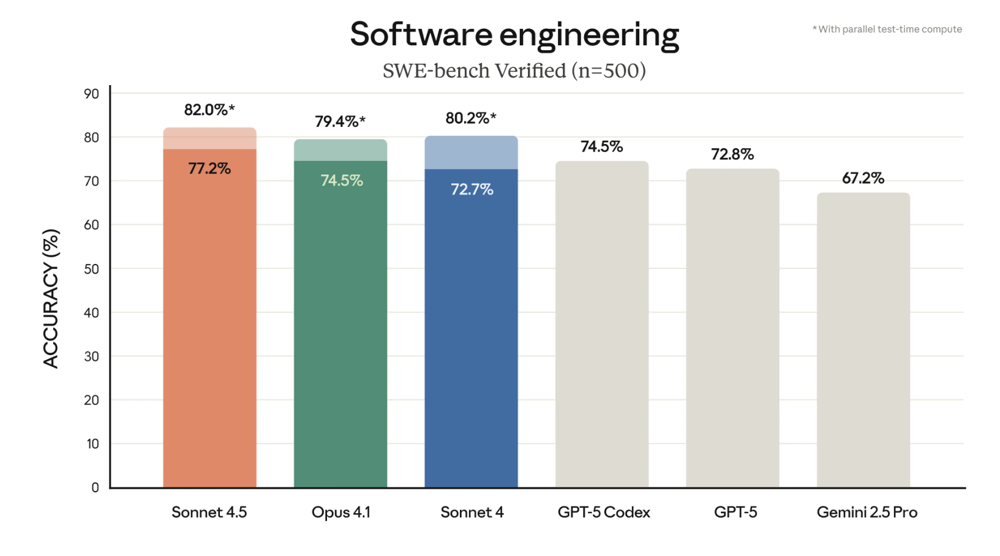

# Claude-Sonnet-4.5 发布了

Claude Sonne5 4.5，终于发布了，可谓是千呼万唤始出来。

## 能力

## 安全性

除了是我们最强大的模型，Claude Sonnet 4.5 也是我们迄今为止最符合预期的前沿模型。Claude 的改进能力和我们广泛的安全生产训练使我们能够显著改善模型的行为，减少了诸如谄媚、欺骗、权力寻求以及鼓励幻想性思维等令人担忧的行为。对于模型的自主性和计算机使用能力，我们在防御提示注入攻击方面也取得了显著进展，这是这些能力用户面临的最严重风险之一。

Claude Sonnet 4.5 将根据我们的 AI 安全级别 3（ASL-3）保护措施进行发布，这符合我们的框架，该框架将模型能力与适当的保护措施相匹配。这些保护措施包括旨在检测潜在危险输入和输出的过滤器，即分类器——特别是与化学、生物、放射性及核（CBRN）武器相关的输入和输出。

## 代理 SDK 

我们已经花费了超过六个月的时间向 Claude Code 发布更新，因此我们深知构建和设计 AI 代理需要什么。我们已经解决了难题：代理如何在长时间运行的任务中管理内存，如何处理在自主性与用户控制之间取得平衡的权限系统，以及如何协调为共同目标工作的子代理。
