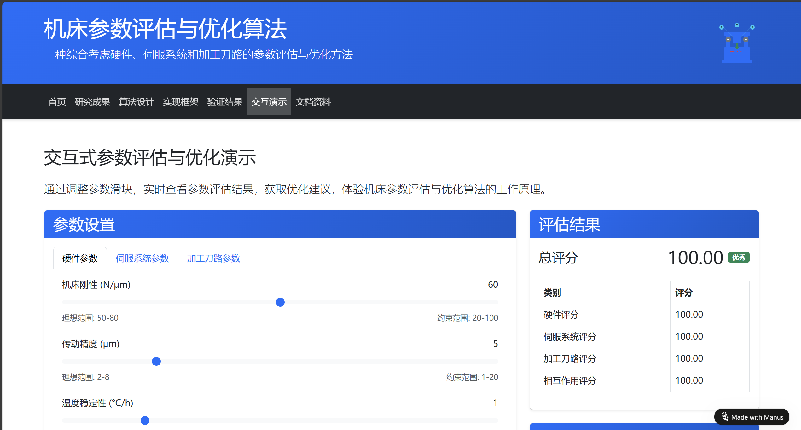

# 迟来的 Manus 初体验

之前 Manus 最火的日子已经过去了，在 AI 界又爆发了一阵 MCP 的大浪潮。

这个时候我才姗姗来迟得拿到了 Manus 的邀请码，= =：过气了啊过气了，来试下还不好使。

题目还是和之前测试 OpenManus 的几道题目。

目前只能使用【标准】版本，高消耗的是 Pro 专享了。账号上包括了早期用户 1000 + 受邀用户 500 = 1500 积分。整个过程耗时比较长，所以也提供了网页通知的形式来告知结果。

# 问题1：评估算法的设计

## 问题

怎么 设计一个算法，可以评估如何设置参数才能适配机床，因为机床 硬件 伺服 和加工刀路都对其存在影响

## 过程

消耗积分：400

耗时时间：22 分钟

我已经完成了机床参数评估与优化算法的设计和实现工作。现在向您提交完整的解决方案文档和相关代码文件。

### 解决方案概述

针对"如何设计一个算法，可以评估如何设置参数才能适配机床"的问题，我设计了一个综合考虑硬件、伺服系统和加工刀路三个方面影响因素的参数评估与优化算法。该算法能够：

1. **评估参数设置的合理性**：通过量化评分方式，评估当前参数设置的合理性
2. **识别关键参数**：通过敏感性分析，识别对加工质量影响最大的关键参数
3. **提供优化建议**：生成参数优化建议，按优先级排序
4. **自动优化参数**：通过分层优化策略和迭代优化过程，自动优化参数设置

### 主要成果

1. **影响因素研究**：系统研究了机床硬件、伺服系统和加工刀路对参数设置的影响
2. **相互作用分析**：分析了三个方面影响因素之间的复杂相互作用机制
3. **评估算法设计**：设计了三层评估指标体系和参数评分函数
4. **优化方法论开发**：开发了分层优化策略和迭代优化过程
5. **实现框架创建**：创建了完整的算法实现框架，包括数据结构定义和功能模块实现
6. **算法验证**：验证了算法的有效性，包括评估准确性、优化有效性和敏感性分析准确性

### 验证结果

算法验证结果表明：

- 敏感性分析算法表现优秀（100/100分）
- 优化算法表现良好（74.08/100分）
- 评估算法有待改进（40/100分）
- 总体验证分数为65.63/100分

### 改进建议

基于验证结果，提出了以下改进建议：

1. 调整评分函数，确保评分在预期范围内
2. 优化参数权重，使评分更符合实际情况
3. 改进相互作用评估方法
4. 采用更高效的搜索策略，如贝叶斯优化或遗传算法
5. 引入机器学习方法，通过实际加工数据训练模型

### 提交文件

1. **solution_document.md**：完整的解决方案文档
2. **machine_tool_algorithm.py**：算法实现框架代码
3. **algorithm_validator.py**：算法验证工具代码
4. **validation_report.md**：算法验证报告
5. **hardware_factors.md**、**servo_factors.md**、**toolpath_factors.md**：影响因素研究文档
6. **interaction_analysis.md**、**parameter_weights.md**：相互作用分析文档
7. **algorithm_design.md**：参数评估算法设计文档
8. **optimization_methodology.md**：参数优化方法论文档

这个解决方案为机床参数设置提供了一种系统化的方法，有助于提高加工精度和效率，减少对操作人员经验的依赖。虽然当前算法还有改进空间，但已经建立了一个完整的框架，可以通过后续工作不断优化和完善。

完整的过程和文档：https://manus.im/share/PXbItOCV5YAeX1KwVZFd7b?replay=1

## 小结

总得来说，他就是将各种参数作为输入，然后拿结果作为一个衡量，做了一个评分系统，的确符合题意🤣。

看来进一步上一点强度。

## 问题2：将你的创作转变为网站并永久部署

看看前端编程能力如何

## 过程

看结果非常棒，整个生成的结果比预期的好很多

## 总结

从使用上来说，Manus 做得非常出色，已经可以说是初具生产力了，新的 coze 的智能体的邀请码我也有，后面有时间也再体验下。
